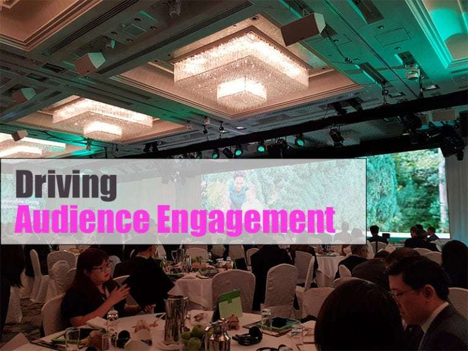

# Going Digital vs. Human Interaction

*April 21, 2018*

---

Name any social media platforms – Facebook, Twitter, Instagram and you’d probably have one account with it. But even in the digital world, human touch still matters a lot. Technologies are meant to complement our capabilities, not replace.

### Human Touch Matters

While you can conveniently look up for a person’s profile online in this digital age, you can’t offer a handshake online. The truth is, building a solid long-lasting relationship with your clients requires a lot of human interaction. Simply put, you can’t expect people to buy big items online without the salesperson’s assistance before and after the sales service

### Digital Technology Engagement

Companies need to invest in technologies but they can’t forget that we value personal interaction as well. Say for an event, you know you can never replace human interaction but you can use digital technologies to ensure and enhance engagement. You still need your speakers to lead the conversation but you can encourage digital communication to drive audience participation.

### Digital Automation

Still, it makes sense that there are some things that technologies can do but we can’t, and that is automation. Sending email updates, analysing registration signup rates and evaluating post-event reports generally require a lot of time which event organisers are unwilling to spend so much time on. And that’s when technologies come in to hasten the process and mitigate the human error.

Essentially, a typical transaction or event can never be fully digitalised. Digital technologies are just tool that enhance our customers’ experience. One size does not fit all, so finding the right mix between human interaction and digital technologies is important.

Ultimately, it’s the people behind these technologies that matter.