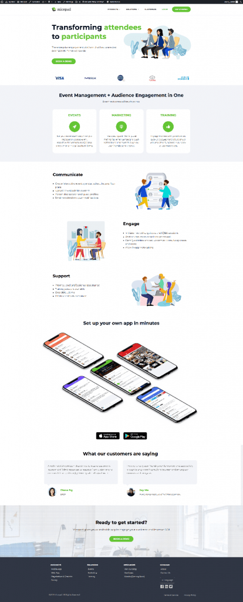
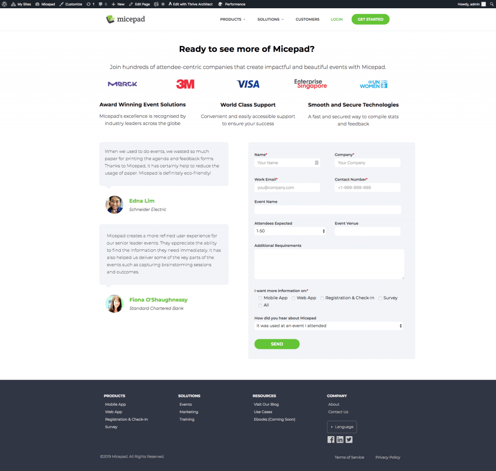
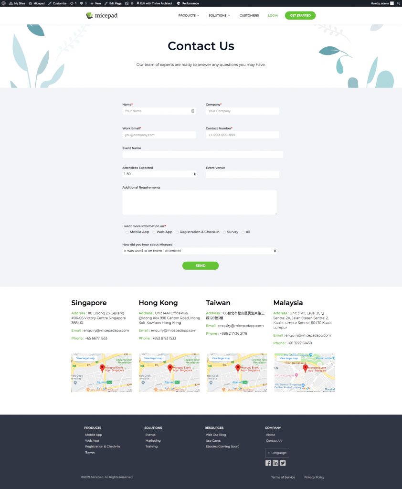

# Announcing: New Website Launch!

*March 12, 2019*

---

If you’re new to Micepad, you may not have noticed this, however previous viewers will DEFINITELY have discovered a huge change. After 3 months of hard work (and cross-country video calls), we’re super excited to finally unveil our new website!

#### Why a Redesign?

Don’t worry – our tech team is still working hard to create the most intuitive and convenient event management and audience engagement platform. (In fact, we’re going to announce a v.8 pretty soon!) However, we felt that we needed to show our dedication to UI/UX in our website too!

### What’s Changed?

#### 1. The Look.

Here’s a side-by-side comparison of our old and new site designs:

As you can see, we’ve kept our brand colours of green and white, but changed up everything else. Our main focuses this time were on ease of navigation and site structure, however our fabulous designer took time to make everything look amazing too!

We have new images, new icons and even new buttons! We’ve also changed our font from *Lato* to *Montserrat* to improve the readability of the site.

#### 2. The Navigation

Since Micepad’s inception, we’ve had 3 previous redesigns (the earliest was slightly over a year ago), and learnt much about online behaviour each time. We realised that we had been a little over-enthusiastic about providing as much information as possible to viewers.

The menu bar was *extremely* cluttered.

Clients were telling us about redundant pages *all the time*. Searching for information about our products was a great challenge and took a long time.

After this update, we’ve condensed all useful information into single pages per product and use case under **“Products” **and **“Solutions”.** That reduced a whopping 23 pages to just 7 pages – less than a third of what we used to have!

Additionally, we’ve also moved all **“About” **page links to the footer instead of the top menu bar. Similar to the old site, current clients can still access the Micepad admin panel through the **“Login”** link, while new clients can contact us through the **“Get Started” **button.

We’ve also moved the Chinese translation button to the footer!

#### 3. The Contact Form(s)

We’ve improved on the design for our contact form, creating 2 in **“Get Started” **and **“Contact Us” **unlike previously:

Those are the 3 main changes that we’ve implemented after 3 months, however there are also many other smaller changes that have been made. Have a quick scroll around and check us out!