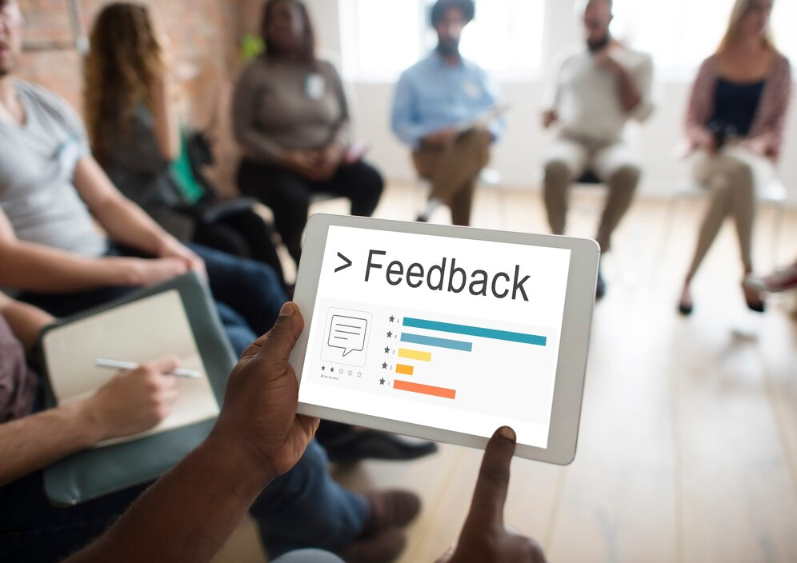

# The Must-Have 2024 Conference Planning Checklist (With Free Template!)

*September 7, 2024*

---

The next time you plan a conference, you will no longer fret age-old event dilemmas. It takes more than just event organising experience to arrange the finest conference for your business and your audience. You need to possess a passion and interest in all things business-related, a good grasp of conference organising, keen attention to detail, a creative mind, and an innate capability to multitask. If you read the above-mentioned qualities and think, “It’s like asking to have superpowers.” Well, great results come with commitment to quality. It also comes with a well-defined and customied [conference planning checklist](conference-planning-checklist.html) to help you keep track of your conference objectives.

### Detailed Conference Planning Checklist

- Define the conference goal.
- Create a memorable and inspiring theme.
- Develop a tagline for additional context.
- Ensure the theme aligns with the conference’s purpose.

- Identify key touchpoints in the attendee journey.
- Ensure all touchpoints align with the conference goal.
- Consider the attendee’s perspective.
- Eliminate superfluous touchpoints.

- Assemble the planning team.
- Assign roles for physical planning, marketing, administration, and facilitation.
- Ensure team members understand their responsibilities.

- Choose potential dates and venues.
- Avoid conflicts with holidays or local events.
- Determine the budget.
- Secure necessary sponsorships if needed.

- Evaluate venues based on size, location, and amenities.
- Check for necessary technology and AV equipment.
- Book the venue well in advance.

- Choose a conference management software.
- Decide on the use of [event apps](../index.html).
- Ensure the technology aligns with the attendee experience.
- Arrange for IT support.

- Book catering and accommodation.
- Arrange transportation and logistics.
- Confirm contracts with all service providers.
- Coordinate with on-site staff.

- Identify and invite potential speakers.
- Confirm speaker availability and requirements.
- Coordinate speaker logistics, including travel and accommodation.

- Draft a conference agenda.
- Ensure sessions align with the conference theme.
- Allocate time for breaks, networking, and Q&A sessions.
- Distribute the agenda to all stakeholders.

- Develop a marketing plan.
- Create promotional materials.
- Utilise social media and email campaigns.
- Monitor and adjust promotion strategies as needed.

- Confirm venue setup requirements.
- Arrange seating, signage, and decorations.
- Conduct a final walkthrough of the venue.
- Ensure all technical equipment is functioning.

- Create a detailed timeline for the event day.
- Assign timekeepers for each session.
- Have contingency plans for delays.
- Communicate timing expectations to all participants.

- Distribute post-conference surveys.
- Collect feedback from attendees, speakers, and sponsors.
- Analyse feedback for insights.
- Document lessons learned for future events.

- Review key takeaways from the conference.
- Follow up on any promises made during the event.
- Share post-conference materials with attendees.

- Update contact lists with new leads.
- Segment contacts for future communications.
- Send thank-you notes to all participants.
- Maintain relationships with sponsors and partners.

#### Step 1 – Settle on a Theme

The first step in planning your conference is to settle on a theme that aligns with your overall goals. This theme should be snappy, memorable, and inspiring, acting as a guiding star for both your team and participants.

By establishing a clear and engaging theme, you create a cohesive narrative that resonates throughout every aspect of the event, making it easier for attendees to connect with the conference’s purpose. You must ensure that the theme of your conference is the heart of your event; everything else should beat in rhythm with it.

#### Step 2 – Design the Delegate Journey

Once your theme is locked in, the next step is to design the delegate journey, which involves planning every interaction your attendees will have with the event. The second step must encompass all the touchpoints:

- Registration
- Food
- Accommodation
- Signage
- Technology

All of these elements must collectively shape the attendee experience. By thoughtfully curating these moments, you ensure that each interaction reinforces your theme and contributes to a positive, seamless experience. Ask yourself, are all the touchpoints moving attendees toward the event’s goal? If so, you’re on the right track.

#### Step 3 – Identify Your Team and Set Roles

Putting the right people in the right places is important for the success of your event. (Credit: Freepik)

No conference can be organised single-handedly, so the third step is assembling a capable team and clearly defining roles. Start by gathering people with diverse skills—those who can handle logistics, marketing, administration, and on-the-ground facilitation.

Each member of your team should have a specific role that plays to their strengths, whether it’s coordinating the venue, managing communications, or being the go-to person on the event day. The key to successful event planning is collaboration and clarity. When everyone knows their responsibilities and how they contribute to the overall success of the event, the planning process becomes much smoother. Your team is your most valuable resource, so choose wisely and keep communication channels open!

#### Step 4 – Settle on a Date, Venue, and Budget

Next up is the crucial step of settling on a date, venue, and budget—three interconnected elements that can make or break your event. It’s best to plan these aspects concurrently to avoid any last-minute surprises. When picking a date, consider avoiding holidays and local events that could clash with your conference.

For the venue, think about size, location, and the [event technology](what-is-event-technology-trends.html) you’ll need. Your event budget should reflect the cost of the venue as it’s usually the largest expense, but don’t forget to allocate funds for other essentials like catering and marketing. Securing the right venue at the right time within your budget requires a bit of finesse, so having backup options and being flexible can help you quite a lot.

#### Step 5 – Book the Right Venue

Once you have a clear budget and date, it’s time to book the right venue. The venue sets the stage for your entire event, so choose one that matches your theme and can comfortably accommodate your attendees. For the logistics, do ask yourself:

*“Does the venue have easy access to public transportation? Is it close to hotels for out-of-town guests? Does it have the necessary tech infrastructure?”*

Also, think about the ambiance since it will be the space that must enhance the experience, not detract from it. Booking a venue well in advance is critical, especially for larger events.

#### Step 6 – Select the Right Conference Technology

Event technology is crucial for making your event engaging and memorable. (Credit: Freepik)

Finally, selecting the right technology for your conference can elevate the attendee experience and streamline [event management](event-manager.html). Today’s conferences benefit from a range of tech options, from essential tools like [event apps](mobile-event-apps-and-conferences.html) and social media walls to more advanced features like AI chatbots and live streaming.

The [event technology](event-technology-trends.html) you choose should align with your event’s goals and enhance the delegate journey. For example, setting up an interactive community forum can foster engagement before, during, and after the event as well as pushing your event marketing, while video tutorials and webinars can provide additional learning opportunities.

#### Step 7 Arrange People and Services

Now that you’ve got the foundation of your event planned out, it’s time to focus on the people and services that will bring your vision to life. Do you need caterers, AV specialists, or maybe a team of volunteers to help things run smoothly? The earlier you book these essential players, the better. Securing these services well in advance gives you the flexibility to handle any changes or unexpected hiccups, which will inevitably pop up as the event date draws closer.

Keep the lines of communication open with everyone involved—keeping them updated on your needs and any changes ensures everyone stays on the same page.

#### Step 8 Book Speakers

Focus on selecting the right speaker for your conference to ensure a successful event. (Credit: Freepik)

We all know that booking the event speakers can make or break your event. A captivating speaker can elevate your conference, leaving attendees inspired and talking about your event long after it’s over. On the flip side, a poorly chosen speaker can derail the whole experience. Start this process at least six months before your event.

Ask yourself, does this speaker align with the goals of your event? Will they resonate with your audience? And, of course, can you afford them? Once you’ve narrowed down your options, check their availability and confirm that they can accommodate your event’s schedule. Whether you’re reaching out to industry leaders, sourcing referrals, or even using an agency, take the time to select a speaker who will leave a lasting impression. Remember, a great speaker doesn’t just fill a time slot—they set the tone for the entire event!

#### Step 9 Plan Your Agenda

Many [event planners](event-management-software-for-event-planners.html) believe that an agenda is just a mere schedule. In fact, you must believe that the agenda itself is the backbone of your event. A well-structured agenda keeps everything on track, ensuring that both your team and your attendees know exactly what’s happening and when.

Start with an opening address to set the tone and outline the day’s (or days’) proceedings. For longer events, planning your time in one or two hour blocks helps keep things manageable and maintains the audience’s focus. Be mindful of meal breaks—no one wants to dive into a heavy topic right before or after lunch. Purposefully plan for periods where attendees can connect and network. And don’t forget to factor in some downtime or lighter sessions to keep energy levels up.

#### Step 10 Promote Your Event

Promotion and marketing can be the trickiest part of planning a conference, but it’s also one of the most critical. If your event is internal, a few well-timed email  reminders can keep your team in the loop. But if you’re reaching out to external audiences, you’ll need to put in more effort.

Start by deciding on a ticket price (if applicable) and make sure it aligns with your target market. From there, focus on both online and offline promotion. Use social media, email marketing, and perhaps even a press release if you have the connections.

#### Step 11 Prepare The Venue

As your event date approaches, your venue preparations need to kick into high gear. You might think that everything will go according to plan since you discussed details with the venue weeks or months ago, but it’s always a good idea to double-check.

A few days before the event, confirm that all your requirements—AV setup, seating arrangements, catering must be still on track. Pay attention to staging as well; a creatively set-up venue can leave a lasting impression. Think about branding opportunities, photo spots, and how the layout will impact attendee movement and interaction. Keeping a close eye on these details will ensure your event space is not just functional but also memorable.

#### Step 12 Stay on Time

Staying on schedule is crucial for the success of your event. Running late can throw off the entire day, frustrating both speakers and attendees. To keep things on track, assign a dedicated timekeeper—ideally someone senior enough to enforce the schedule.

Use tools like timecards to give speakers a heads-up as their time winds down, and make sure your team is briefed on the day’s timeline in advance. Starting the day with a quick team meeting can help address any last-minute issues and ensure everyone knows what to expect.

#### Step 13 Gather Feedback

Conference feedback can be used to refine your approach and ensure that your next event is even better. (Credit: Freepik)

Feedback is gold. It’s how you measure the success of your event and learn what you can improve for next time. Plan to gather feedback as soon as the event concludes—while everything is still fresh in attendees’ minds.

You can do this through surveys, quick polls, or even just a simple rating system at the exit. Ask about what they liked, what they didn’t, and what could be improved. But don’t stop there—get feedback from your team as well. They’ve been on the front lines and can provide insights that attendees might miss. This feedback is invaluable for refining your approach and ensuring that your next event is even better.

#### Step 14 Follow Up on Conference Themes/Promises

Your conference may end when the last attendee leaves, but your effort in the event doesn’t. Follow up on the themes, discussions, and promises made during the event right after the event ends. This could mean sending out summary notes, additional resources, or even reaching out to potential leads generated during the event.

The key is to keep the momentum going while everything is still fresh in everyone’s minds. A timely follow-up not only reinforces the impact of your event but also helps build lasting relationships with your attendees.

#### Step 15 Keep Track of Interested Parties for the Future

Finally, don’t lose track of the connections you’ve made. Keep a detailed list of attendees and note down the sessions they found most interesting. This information is incredibly valuable for future events—it helps you target the right people with the right content.

Whether you’re planning another event or simply looking to expand your network, having a well-organised list of engaged participants can be a game-changer. Use this data to personalise your outreach and make sure your next event is even more successful.

And there you have it! By following these steps, you’re setting yourself up for a smooth, successful, and memorable conference that attendees will be talking about long after it’s over.

### Simplified Conference Planning Checklist for Beginners

#### 1. Define the objectives

The first thing you need to do when  creating a conference planning checklist is to specify these aspects:

- ‘Who’, ‘What’, ‘Where’, ‘When’ and ‘How’ of your event.
- Who is your target audience? Who are your guest speakers?
- What is the theme of your conference? What do you aim to achieve with your event?
- Where will your conference be held? Will it be an indoor or outdoor event?
- When will your conference take place?
- How many people do you plan to invite? How will you gauge the success of your event? How much is the allocated budget for your conference?

#### 2. Zoom In on The Details

Now that you’ve given concrete answers to the most vital parts of your conference, it’s time to be more specific with your event.

##### 1. Venue

Do some research on which locations fit your budget, target audience size, and theme. Check hotels, conference halls, convention halls, gardens, rooftops and outdoor locations that provide good space and ambience.

You can also contact the venue’s management and personnel and request to recee the area and conduct inspections around the site. Don’t forget to compare your venue options based on prices, accommodations, banquet options, transportation, parking, routes, facilities, and convenience.

##### 2. Speakers

Deciding on a theme gives you a better idea on who to choose for your list of guest speakers. Create a preliminary list of personalities and officials who you think would be a best fit for your conference. If you can, research their background, credentials and previous guest speaking appearances.

Go over your research and narrow down your potential speakers to a final list before you start reaching out to them. Then, discuss the schedules for their speeches. It is important that you and your speakers agree on the schedule and arrange accommodations especially if there are speakers who will be travelling from afar.

##### 3. Agenda

It is better to put together a finalised agenda at least 4-5 months before the date of your conference. Identify who your target attendees are and have a better understanding of what motivates and inspires them along with what expectations they may have from your conference. Organise which speakers will have their presentations first.

You must also determine who will open the show, who will conduct workshops in the middle of the conference, and who will present a motivational speech to wrap up the show. If there are other activities aside from speeches, presentations, and product exhibitions, make sure to assimilate these activities smoothly into the entire program proper.

Moreover, think about how your attendees will participate. Will they all be required to attend all presentations or will some of them be given the freedom to choose speeches and workshops that they want to attend?

##### 4. Attendee Registration

Planning how your attendees will register to your event helps save more time and money. At present, using [event apps](../products/mobile-event-app.html) in place of pen-and-paper registrations is more efficient. You can assign a QR code to your attendees so that when they arrive at the venue, a QR code scanner can verify their identity.

You can also opt to send online invitations and enable [online event registrations](../products/online-event-registration-software.html) to help diminish long queues on the day your conference commences. Keep track of RSVPs done online to ensure that your entire guest list won’t overlap.

#### 4. Delegate Tasks and Responsibilities

Create and manage a dedicated team to help you carry out your conference’s plan and objectives. Assign staff and volunteers to different teams and committees, particularly for the following:

- Managing your event budget, venue, program and  ticket sales
- Pre-event planning
- Advertising and PR
- Applying for and securing [event sponsorships](event-sponsorship.html)
- Organising and keeping track of your guest list
- Assisting and ushering guests as well as manning and watching stalls, registration areas, and other amenities in the venue
- Distributing event surveys

#### 5. Promote Your Event

With the right channels and promotion strategy, your event can be a major hit. (Credit: Freepik)

Draw attention to your event and entice more people to attend through implementing an effective marketing strategy. Choose the channels you will use to market your conference. Today, social media is one of the most effective and popular ways that brands get to disseminate information about their event.

You can also prepare advertising materials such as banners, brochures and print ads that you can post or distribute in strategically chosen places. Another option would be to design a logo for your conference and have it printed alongside the date and venue on mugs, t-shirts, and even giveaways distributed during your event.

If you can, apply for [event sponsorships](how-to-get-event-sponsorship.html) especially if you need assistance in financing your event. Just make sure the sponsors you choose support your conference’s theme and end-goals.

#### Don’t Forget to Include Audience Feedback

Surveys and feedback forms can be distributed before, during, or after your event. You need to decide on what type of feedback you want from your attendees to be able to put together a brief series of questions for your conference survey. Instead of distributing pens and papers for your surveys, you can also employ the assistance of an event app to [create digital survey forms](../products/online-event-registration-software.html) that attendees can answer through their mobile devices.

#### Prepare A Back-up Plan

While we don’t want to come off as pessimistic, sometimes, things don’t always go right when you plan an event. There are several unpleasant scenarios that could take place, such as sudden weather disturbances delaying travel time or postponing event schedules, a sponsor, a guest speaker or the catering team cancels at the last minute, or some event props and devices stop working right when you need it.

It is always smart to prepare an alternative for when your initial plans don’t always go the way you want it to. Think 3-5 steps ahead so you can maintain your composure and devise a back-up plan quickly when unforeseen or unexpected mishaps take place.

### Benefits of Following a Conference Planning Checklist

When it comes to organising a conference, having a checklist can make all the difference between a smooth, successful event and one filled with stress and last-minute chaos. You’ve got a lot on your plate, and keeping track of every detail can be overwhelming. That’s where a conference planning checklist steps in, acting as your trusty guide throughout the entire process.

First and foremost, a checklist ensures you don’t miss a thing. With so many moving parts like securing the venue, coordinating with speakers, managing registrations, and handling logistics, it’s easy for details to slip through the cracks. A well-crafted checklist helps you stay on top of every task, big or small, so nothing is overlooked. It’s your safety net, ensuring that you’ve covered all bases.

Another major benefit is time management. A checklist helps you break down the planning process into manageable steps, making it easier to prioritise tasks and set deadlines. You can tackle each item methodically, without feeling like you’re drowning in a sea of responsibilities. Plus, by spreading tasks over time, you avoid the last-minute rush, allowing you to focus on delivering a polished, professional event.

Following a checklist also promotes better communication with your team. When everyone is on the same page, it’s easier to delegate tasks and track progress. Each team member knows exactly what they’re responsible for, reducing the chances of confusion or duplicated efforts. This clarity not only streamlines the planning process but also fosters a collaborative environment where everyone can contribute effectively.

In short, a conference planning checklist is your best friend in the world of event management. It keeps you organised, helps manage your time, improves team communication, and ensures nothing is left undone.

### Wrapping up

your conference planning checklist, remember that every step you take brings you closer to a successful event. But there’s one more crucial element to consider: integrating an event app into your strategy.

An event app can streamline communication, enhance attendee engagement, and keep all aspects of your conference organised in real-time. It’s the modern solution that ties everything together, making your event not only more efficient but also more interactive and enjoyable for your guests.

As you put the finishing touches on your conference plan, consider Micepad as your go-to event app. With its robust features designed to simplify [registration](../products/online-event-registration-software.html), manage ticketing, and amplify your branding through customisable pages, Micepad can be your powerful tool that can elevate your event experience. Embrace the future of event planning with Micepad and watch your conference transform into a standout success. Request a demo today!

