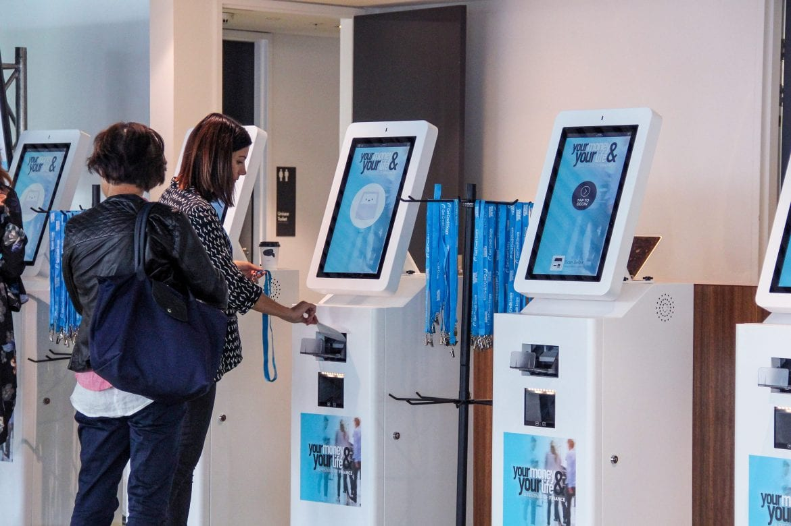

# Set Up On-Site Event Check-In: Challenges, Tips, & Best Practices

*August 29, 2024*

---

Setting up [on-site event check-in](event-check-in.html) is a game with its own rules, and it can quickly become a snowball of challenges, especially as the event grows. The check-in process can go awry if not managed carefully, from long lines to tech glitches. To ensure a smooth and successful check-in, you must understand the challenges you might face and be prepared to tackle them head-on. In this article, we’ll dive into these challenges, share practical tips, and lay out best practices to help you master the on-site check-in process and keep everything running seamlessly.

### D-Day: Challenges in Check-In Process

Check-in is one of the most crucial parts of an event. If your check-in process is quick, seamless, and efficient, your guests will walk in already having had a great experience with your brand. But if there are hold-ups at the door, fumbling around for name badges, or endlessly flipping through guest lists, your guests may walk in flustered, annoyed, or worse – not impressed by your event right off the bat! Let’s try to avoid those angry tweets.

#### 1. Long Queues and Wait Times

(Credit: Campaign Asia)

Long check-in lines can frustrate attendees from the start. If not handled properly, this can lead to complaints, negative feedback, and a stressful atmosphere. People like to start immediately, especially when they’re excited to join the event, network, or attend sessions. Ensure you prepare this thoroughly so there will be no fuss when the event starts.

**Questions to consider regarding the queue and wait times:**

- How many check-in counters do you have compared to the expected attendees?
- Do you have enough staff to manage the check-in process efficiently? (We recommend one door staff member for every 50 guests)
- Can you implement a staggered arrival time system to spread out the flow of attendees?
- Are there ways to pre-check in some attendees or provide self-check-in options to speed up the process?
- How are you going to organise the lines?
- Will you need a separate entrance for VIPs?

#### 2. Technical Glitches

(Credit: Fimela)

Technical check-in software or hardware issues can cause significant disruptions, and the chance is always there. Imagine your system crashing or devices not working as attendees arrive. This can lead to delays, confusion, and a lot of stress for attendees and staff—a total mess!

**Here are the checklist questions to avoid technical glitches:**

- Have you tested all your [check-in equipment](https://sgpad.com/event-registration/) thoroughly before the event day?
- Do you have a reliable IT support team on-site to handle any technical issues promptly?
- Is there a backup system in place in case the primary system fails?
- Are your check-in staff trained to troubleshoot fundamental technical problems?

#### 3. Verification and Security

Ensuring that only registered attendees gain entry is crucial for security and logistics. However, a cumbersome verification process can slow things down and irritate attendees. Balancing thorough checks with efficiency is vital. Not just fast, you must ensure the check-in process is secure with only invited people coming in.

**Questions to consider in verification and security problems that may arise during check-in:**

- What methods will you use to verify attendee identity quickly and accurately?
- Are you prepared to handle cases where attendees have lost their tickets or credentials?
- How will you manage VIPs or special guests to ensure they receive the appropriate level of service without causing delays?
- Do you have clear protocols for handling security concerns or unauthorised entries?
- Do you need security staff? (Yes, most likely)
- How long will you need the door to be staffed?
- Will your door staff need shifts?

#### 4. Communication Breakdown

Miscommunication or lack of information can lead to confusion and frustration. Attendees need to know where to go, what to do, and how the check-in process works so they will not be stranded, not knowing what to do. With clear instructions, the entire process can be smooth.

**Checklist questions to avoid miscommunication in the check-in process:**

- Have you communicated all necessary check-in details to attendees before the event?
- Are there clear, visible signs and instructions at the check-in area?
- Do your staff know the check-in process inside and out, and are they equipped to answer attendee questions?
- Is there a system to quickly address any issues or questions during check-in?

#### 5. Handling Last-Minute Changes

Last-minute changes, such as additional attendees or changes in attendee details, can disrupt the check-in process. Flexibility and adaptability are crucial to managing these changes without causing delays or confusion.

**Questions to think of regarding last-minute changes:**

- How will you efficiently update your check-in system with last-minute changes?
- Do you have a protocol for handling on-the-spot registrations or modifications?
- Are your staff trained to handle last-minute issues calmly and efficiently?
- Is there a clear process for communicating changes to all relevant staff members?

#### 6. Running The Door for VIP Events

VIP events require an extra level of perfection (after all, they matter at the end of the day). Our best advice is to have an entirely separate program for your VIPs.

The whole process must be pretty simple if you don’t design any tier for your attendees. But if you do, here are some questions to navigate the challenge that may arise:

- Do you need  VIP guests to come through a specific door?
- Can VIPs have a separate arrival time (at least an hour early)?
- Can you give VIP guests a different color wristband, lanyard, etc.?
- Will VIPs meet you somewhere in advance to pick up their VIP bracelet?
- How will you organise the flow at the VIP entrance to avoid other guests wandering over?

### Event Check-In Best Practices

We’ve gathered top-notch best practices on handling event check-in like a pro to ensure your guests have a smooth and enjoyable arrival experience. Here are some of the tips:

#### First and Foremost, Communicate with Your Team

(Credit: Dgtcom)

Having a well-trained and well-briefed team can make all the difference, right?

##### 1. Conduct a Thorough Pre-Event Briefing

Before the event, gather your team for a detailed briefing session. Review the check-in process, ensuring everyone knows their specific roles and responsibilities. Clarify any potential issues and how to handle them. This will help your team feel confident and prepared, reducing the likelihood of confusion or mistakes on the event day.

##### 2. Establish Clear Communication Channels

Set up reliable communication channels for the day of the event. This could be through walkie-talkies, a group chat, or an event management app. Ensure everyone knows how to reach each other quickly if issues arise. Clear communication can help resolve problems swiftly and keep the check-in process running smoothly. The last thing you want at the door is a long line, angry guests, and a frazzled staff.

**💡 Pro Tips: Always Be in Contact with the Door**

Maintaining constant communication with your door team is crucial. You should always, and we mean always, be in contact with the team running the door at your event. This ensures that any issues or updates are communicated promptly, keeping the process seamless.

#### Get Support with Event Technology

(Credit: Exhibition News)

Using [event technology](what-is-event-technology-trends.html) can streamline your check-in process when working with a small or large team or planning an intimate gathering or a massive event.

##### 1. Utilise Event Management Softwares

Implement [event management softwares](../index.html) to streamline check-in. This technology can handle attendee [registration](event-registration.html), ticket scanning, and real-time updates, allowing your team to focus on providing excellent service. It’s especially beneficial for small teams as it automates many tasks, saving time and energy.

**💡 Pro Tips: Leverage Self-Check-In Kiosks**

Self-check-in kiosks can significantly reduce wait times and improve the attendee experience for more significant events. These kiosks allow guests to check themselves in quickly and easily, allowing your team to handle more complex tasks and interact more personally with attendees. It ensures the process remains organised and efficient even with a large crowd.

Plus, on-site badge printing can save your team from the hassle of pre-printing and organising badges, ensuring a smooth experience for everyone.

#### What to Do with The Guests?

(Credit: Yslv)

Your guests’ first impression starts at check-in, so keeping them happy and satisfied here sets the tone for the event. Make them feel welcomed and valued from the moment they arrive.

##### 1. Provide Clear Instructions:

Ensure your guests know exactly what to expect before they arrive. Send detailed pre-event emails with all necessary information, such as check-in times, what they need to bring, and where to go. Clear instructions help attendees feel prepared and reduce the chances of confusion at the check-in desk.

##### 2. Offer a Warm Welcome

First impressions matter. Train your staff to greet each attendee with a smile and a friendly attitude. A warm welcome sets a positive tone for the entire event. If guests feel valued and appreciated when they arrive, they’re more likely to have a positive experience and speak highly of your event.

**💡 Pro Tips: Set Up On-Site Information Signage**

Provide guests with on-site information right when they walk through the door. Set up signage or TV visuals that remain in the same place and provide relevant information for the event (i.e., a map of the venue or breakout session times) that they can refer back to at any moment. This helps guests navigate the event smoothly and stay informed without needing assistance.

To wrap things up, it’s always better to be safe than sorry regarding on-site event check-in. Take the time to prepare thoroughly and double-check everything to avoid any last-minute stress. A smooth check-in sets a positive tone for your event and ensures your guests feel welcomed from the start.

If you want to make this process even easier, consider trying [Micepad](../index.html)! Our [event registration](../products/online-event-registration-software.html) solution  can streamline check-ins, capture real-time data, and help keep everything running smoothly, so you can focus on making your event a success. Request a demo today!

