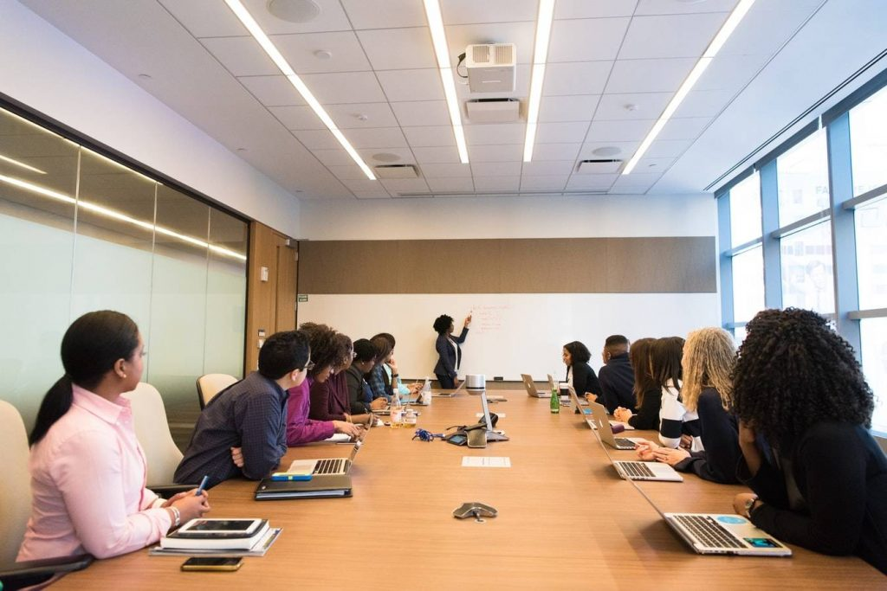

# Micepad on Todays’ Enterprise Tech Conferences Trends

*September 21, 2018*

---

**The competition has gone fiercer and fiercer**

The competition has gone fiercer and fiercer for tech conferences. At present, it is no longer just about who introduces the most interesting products or has the most impressive line-up of topics to discuss. With attendee experience becoming a bigger priority, the goal of tech conferences drastically shifted into how brands and organisers can produce a highly lively event for their audience. This is the reason why famous artists, musicians, influencers and speakers are now becoming regulars at tech events.

[Several event industry experts have taken notice of this drastic change](https://www.businesstimes.com.sg/startups/celebrities-bring-star-power-to-enterprise-tech-conferences), and Micepad Singapore Co-founder and CEO Tan Jie Hao  provides his thoughts on the said matter.

#### Tech conferences today are like chicken soup for the aspiring souls.

Mr. Tan Jie Hao adds that for attendees, “…*knowing that there are companies creating innovative products and services can be an extremely motivating experience.” *

As someone who has been helping several brands produce noteworthy events for their products and services through the highly multi-functional Micepad event app platform, Mr. Tan has had a fair share of first-hand knowledge and significant experiences that make his input on today’s tech conferences very valuable.

#### Mr. Tan Jie Hao’s Observations on MICE Trends

Brands are taking advantage of attendees’ eagerness to discover [new technologies and trends](10x-tech-eventtech-trends-to-look-forward-to.html) by combining new information with an element of fun and enjoyment. As a result, it becomes easier for brands to engage their target audience while attendees retain information through associating new learning with a memorable experience.

It is important to know what appeals to an audience and find a way to merge it with what’s brand new about your products and your services. The key is to find the middle ground that balances your goals with what your audience anticipates from your event. In this case, music worked as the most effective middle ground for enterprise tech conferences. This has also been a trend that Mr. Tan has observed lately in tech events.

“*Tech conferences are being disrupted with live band performances to stand out from the rest”.*

#### Music equals mayhem: Is the growing competition good for the future of enterprise tech conferences?

In addition, live streaming and video content are becoming more frequently used thanks to how effective and instantly it boosts user experience. Now pair that up with a live concert of a world-renowned legendary artist being broadcasted across several social media channels as your event takes place. Your brand will surely gain higher traffic from the exposure and association to a trusted artist alone. Before you even realize it, people will be clamoring to your website and your social media pages, eager to learn more about the brand that their favorite artist is seemingly endorsing.If this trend continues on, who knows, maybe [web-based](../products/virtual-event-platform.html) or [mobile event apps](../products/mobile-event-app.html) like Micepad will start developing features that highlight how to employ the effects and advantages of music more effectively for your event!

The strong influence of music to a crowd, regardless of the demographic, is undeniable. This is probably why more and more event organizers are using music to fuel a more dynamic edge against their competitors. It would seem that businesses that target a younger crowd are in for a treat as well. If brands are able to tap into the interests of young buyers, particularly through their generation of music, it will speak volumes about how they want to connect with their target audience regardless of the age bracket where they belong.